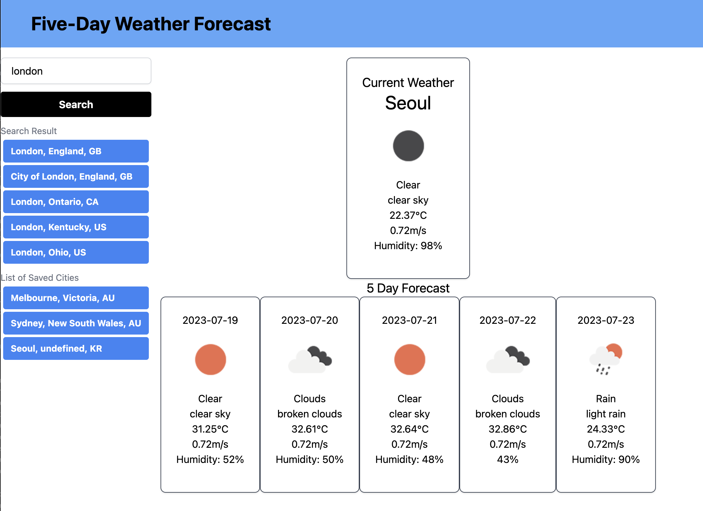

# challenge6-weather-forecast

App that plans a route and checks weather at your destination

## User Story
AS a User, I want to plan my route and check the weather in the same application

As a User, I want to be presented with the options for method of travel to my destination

As a User, I want to have a clearly presented page with easy to use input fields that remembers my previous queries

## Usage
The site has three main sections, one of which displays a map to indicate the length of the route, one to display the weather at said destination and one to list route options and time.
Above are two input fields, one for destinationa and one for starting location. After inputing both fields and pressing the 'check' button the route is displayed on the map and the weather and route times are displayed next to it.

# Deployed Link
https://emelmusica.github.io/weather-book/

# Screenshot

# Github Repository
https://github.com/emelmusica/weather-book

# Figma Wireframe
https://www.figma.com/file/vHpiAdg21lkUKiF39qi6zf/UBER-WEATHER-APP---03?type=whiteboard&node-id=0-1&t=5PgDYShhQgt5MgSm-0
